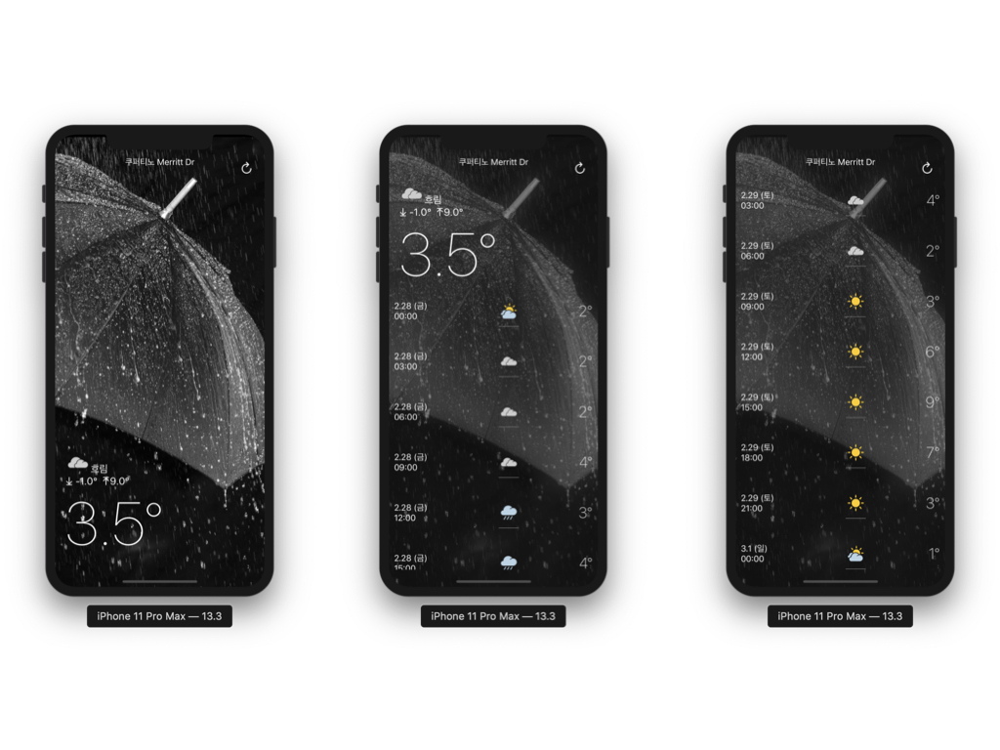

# 날씨앱
> 처음으로 만들어본 앱

[SK Weather Planet API](https://openapi.sk.com/api/detailView)를 사용하여 만든 날씨앱

## 설명

- 기간: 2020.02.24 ~ 2020.02.27
- 사용 기술:
  - 언어: Swift
  - 프레임워크: UIKit
- 인원: 1명
- 성과: 
  - ScrollView를 대체하여 TableView를 사용
  - API를 처음 적용해보았다.
- 아쉬운점:
  - 날씨 API를 사용하려면 비밀키를 받아야하는데 해당 비밀키를 코드상에서 어떻게 숨겨할지 모르겠다.
  
## 결과

 
